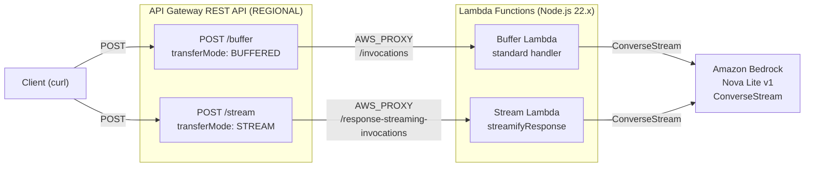

# Design Document: API Gateway Response Streaming Demo

## Overview

This demo application deploys a single Amazon API Gateway REST API (REGIONAL) with two POST endpoints — one buffered, one streaming — both backed by Node.js 22.x Lambda functions that invoke Amazon Bedrock Nova Lite via ConverseStream. The goal is a side-by-side comparison of buffered vs. streamed LLM responses using curl.

The key architectural insight is that both Lambda functions perform the same Bedrock ConverseStream call with the same prompt, but differ in how they deliver the response to the client:

- **Buffer Lambda**: Collects all chunks, returns a single payload (standard handler).
- **Stream Lambda**: Writes each chunk to the response stream as it arrives (`awslambda.streamifyResponse`).

All infrastructure is Terraform-managed using an inline OpenAPI specification with `x-amazon-apigateway-integration` extensions on the `aws_api_gateway_rest_api` resource. This approach is used because the Terraform AWS provider does not yet support the `response_transfer_mode` attribute natively, but the AWS API Gateway OpenAPI extensions fully support `responseTransferMode`. No authentication is required on either endpoint.

## Architecture



### Request Flow

1. Client sends POST to either `/buffer` or `/stream` on the REST API stage URL.
2. API Gateway proxies the request to the corresponding Lambda function.
   - Buffer endpoint uses standard `/invocations` path.
   - Stream endpoint uses `/response-streaming-invocations` path with `responseTransferMode: "STREAM"` set in the `x-amazon-apigateway-integration` OpenAPI extension.
3. Lambda invokes Bedrock ConverseStream with the shared prompt and `maxTokens: 2048`.
4. Buffer Lambda collects all chunks, returns a single JSON-like response body.
   Stream Lambda writes each `contentBlockDelta.delta.text` chunk to the response stream immediately.
5. Client receives either a delayed full response (buffer) or progressive chunks (stream).

## Components and Interfaces

### Project Structure

```
/
├── terraform/
│   ├── main.tf              # Provider, REST API (OpenAPI body), deployment, stage
│   ├── lambda.tf             # Lambda functions, shared IAM role/policy, Lambda permissions
│   └── outputs.tf            # Invoke URLs for both endpoints
├── lambda/
│   ├── buffer/
│   │   └── index.mjs         # Buffer Lambda handler
│   └── stream/
│       └── index.mjs         # Stream Lambda handler
└── README.md                 # Demo instructions with curl commands
```

### Component: Buffer Lambda (`lambda/buffer/index.mjs`)

**Interface:**
```javascript
// Standard Lambda handler signature
export const handler = async (event, context) => {
  // Returns: { statusCode: 200, headers: {...}, body: string }
  // On error: { statusCode: 500, headers: {...}, body: string }
}
```

**Behavior:**
1. Creates a `BedrockRuntimeClient` for region `eu-south-2`.
2. Sends a `ConverseStreamCommand` with model `amazon.nova-lite-v1:0`, the shared prompt, and `maxTokens: 2048`.
3. Iterates over the response stream, concatenating all `contentBlockDelta.delta.text` values.
4. Returns the concatenated text as the response body with `Content-Type: text/plain` and status 200.
5. On error, returns status 500 with a descriptive error message.

### Component: Stream Lambda (`lambda/stream/index.mjs`)

**Interface:**
```javascript
// Streaming Lambda handler signature
export const handler = awslambda.streamifyResponse(
  async (event, responseStream, context) => {
    // Writes chunks to responseStream, then calls responseStream.end()
  }
);
```

**Behavior:**
1. Creates a `BedrockRuntimeClient` for region `eu-south-2`.
2. Wraps `responseStream` with `awslambda.HttpResponseStream.from()` setting status 200 and `Content-Type: text/plain`.
3. Sends a `ConverseStreamCommand` with model `amazon.nova-lite-v1:0`, the shared prompt, and `maxTokens: 2048`.
4. For each `contentBlockDelta` event, calls `responseStream.write(delta.text)`.
5. After the stream completes, calls `responseStream.end()`.
6. On error, writes an error message to the stream and ends it.

### Component: Terraform Configuration

**REST API and Endpoints (OpenAPI body in `main.tf`):**

- `aws_api_gateway_rest_api`: Creates the REST API with a REGIONAL endpoint configuration. The API structure (paths, methods, integrations) is defined via an inline OpenAPI 3.0.1 specification in the `body` attribute, using `x-amazon-apigateway-integration` extensions. This approach is used because the Terraform AWS provider does not yet natively support the `response_transfer_mode` attribute on `aws_api_gateway_integration`, but the OpenAPI extension `responseTransferMode` is fully supported by the AWS API.
  - `/buffer` POST: `x-amazon-apigateway-integration` with `type: aws_proxy`, `httpMethod: POST`, URI pointing to the Buffer Lambda's standard `/invocations` path. No `responseTransferMode` (defaults to BUFFERED).
  - `/stream` POST: `x-amazon-apigateway-integration` with `type: aws_proxy`, `httpMethod: POST`, URI pointing to the Stream Lambda's `/response-streaming-invocations` path, with `responseTransferMode: STREAM`.
- `aws_api_gateway_deployment`: Triggers on changes to the REST API body.
- `aws_api_gateway_stage`: Deploys the API to a named stage (e.g., `demo`).

**IAM Role (shared, in `lambda.tf`):**
- A single `aws_iam_role` with a trust policy allowing `lambda.amazonaws.com` to assume it.
- Attached inline policy granting `bedrock:InvokeModelWithResponseStream` on the Nova Lite model ARN.
- Attached `AWSLambdaBasicExecutionRole` managed policy for CloudWatch Logs.
- Both Lambda functions reference this same role.

**Lambda Permissions (in `lambda.tf`):**
- `aws_lambda_permission` for each function allowing `apigateway.amazonaws.com` to invoke it.

### Shared Prompt

Both Lambda functions use the same hardcoded prompt to ensure a fair comparison:

```
"Write a detailed, comprehensive guide about the history and evolution of cloud computing, covering at least the following topics: early mainframe time-sharing, the rise of virtualization, the birth of AWS and public cloud, the evolution of serverless computing, containers and Kubernetes, and future trends. Be thorough and include specific dates, companies, and technical details."
```

This prompt is designed to produce a multi-paragraph response that makes the streaming benefit clearly observable.

## Data Models

### API Gateway Request (POST body)

No request body is required. Both endpoints ignore the request body and use the hardcoded prompt. The POST method is used to align with API Gateway streaming requirements.

### Buffer Lambda Response

```json
{
  "statusCode": 200,
  "headers": {
    "Content-Type": "text/plain"
  },
  "body": "<full concatenated text from Bedrock>"
}
```

Error response:
```json
{
  "statusCode": 500,
  "headers": {
    "Content-Type": "text/plain"
  },
  "body": "Error generating response: <error message>"
}
```

### Stream Lambda Response

The stream Lambda does not return a JSON object. Instead it writes directly to the response stream:

- HTTP metadata: `{ statusCode: 200, headers: { "Content-Type": "text/plain" } }` set via `HttpResponseStream.from()`.
- Body: sequential `write()` calls with each text chunk from Bedrock, followed by `end()`.
- On error: a single `write()` with the error message, then `end()`.

### Bedrock ConverseStream Request

```javascript
{
  modelId: "amazon.nova-lite-v1:0",
  messages: [
    {
      role: "user",
      content: [{ text: PROMPT }]
    }
  ],
  inferenceConfig: {
    maxTokens: 2048
  }
}
```

### Terraform Outputs

| Output Name | Value |
|---|---|
| `buffer_endpoint_url` | `https://{api-id}.execute-api.eu-south-2.amazonaws.com/{stage}/buffer` |
| `stream_endpoint_url` | `https://{api-id}.execute-api.eu-south-2.amazonaws.com/{stage}/stream` |


## Correctness Properties

*A property is a characteristic or behavior that should hold true across all valid executions of a system — essentially, a formal statement about what the system should do. Properties serve as the bridge between human-readable specifications and machine-verifiable correctness guarantees.*

### Property 1: Buffer Lambda concatenates all Bedrock chunks

*For any* sequence of `contentBlockDelta` text chunks returned by Bedrock ConverseStream, the Buffer Lambda's response body should equal the concatenation of all chunk texts in order, with HTTP status 200 and Content-Type `text/plain`.

**Validates: Requirements 2.6**

### Property 2: Buffer Lambda returns 500 on Bedrock error

*For any* error thrown by the Bedrock client during the Buffer Lambda's invocation, the Lambda should return an HTTP 500 response with a body containing a descriptive error message.

**Validates: Requirements 2.7**

### Property 3: Stream Lambda writes each chunk and ends the stream

*For any* sequence of `contentBlockDelta` text chunks returned by Bedrock ConverseStream, the Stream Lambda should write each chunk's text to the response stream in order and call `end()` after the last chunk, producing a complete streamed response.

**Validates: Requirements 3.8, 3.9**

### Property 4: Stream Lambda writes error and ends stream on failure

*For any* error thrown by the Bedrock client during the Stream Lambda's invocation, the Lambda should write an error message to the response stream and call `end()`, ensuring the stream is properly closed.

**Validates: Requirements 3.10**

## Error Handling

### Buffer Lambda Errors

- **Bedrock client errors** (throttling, model unavailable, service errors): Caught in a try/catch block. The Lambda returns `{ statusCode: 500, body: "Error generating response: <message>" }`.
- **Empty response stream**: If Bedrock returns no `contentBlockDelta` events, the Lambda returns an empty body with status 200 (not an error — the model simply produced no output).

### Stream Lambda Errors

- **Bedrock client errors**: Caught in a try/catch block. The Lambda writes the error message to the response stream via `write()` and then calls `end()`. Since HTTP metadata (status 200) is set before streaming begins via `HttpResponseStream.from()`, the client may receive a 200 status followed by an error message in the body.
- **Stream write errors**: If `write()` fails, the Lambda should still attempt to call `end()` to avoid hanging connections.

### Terraform Deployment Errors

- **Missing AWS profile**: Terraform will fail at `init`/`plan` if the "demo" profile is not configured. The README should note this prerequisite.
- **Region availability**: If `eu-south-2` doesn't support Bedrock Nova Lite, the Lambda will fail at runtime. The README should note model availability requirements.
- **Lambda packaging**: If the `lambda/buffer/` or `lambda/stream/` directories don't exist or are empty, `terraform apply` will fail during the archive data source step.

## Testing Strategy

### Unit Tests

Unit tests verify specific examples, edge cases, and error conditions for the Lambda functions:

- **Buffer Lambda**: Mock the Bedrock client to return a known sequence of chunks. Verify the response body matches the expected concatenation, status is 200, and Content-Type is `text/plain`.
- **Buffer Lambda error**: Mock the Bedrock client to throw an error. Verify the response has status 500 and a descriptive error message.
- **Stream Lambda**: Mock the Bedrock client and the response stream. Verify each chunk is written in order and `end()` is called.
- **Stream Lambda error**: Mock the Bedrock client to throw. Verify an error message is written to the stream and `end()` is called.
- **Edge case — empty Bedrock response**: Mock the Bedrock client to return zero chunks. Verify the Buffer Lambda returns an empty body with status 200, and the Stream Lambda calls `end()` without writing any chunks.

### Property-Based Tests

Property-based tests verify universal properties across randomly generated inputs. Use a property-based testing library for Node.js (e.g., `fast-check`).

Each property test should run a minimum of 100 iterations.

Each test must be tagged with a comment referencing the design property:

- **Feature: apigw-response-streaming-demo, Property 1: Buffer Lambda concatenates all Bedrock chunks** — Generate random arrays of text strings as mock Bedrock chunks. Invoke the Buffer Lambda handler with a mocked Bedrock client returning those chunks. Assert the response body equals the concatenation of all input strings.

- **Feature: apigw-response-streaming-demo, Property 2: Buffer Lambda returns 500 on Bedrock error** — Generate random error messages/types. Mock the Bedrock client to throw each error. Assert the response status is 500 and the body contains an error message.

- **Feature: apigw-response-streaming-demo, Property 3: Stream Lambda writes each chunk and ends the stream** — Generate random arrays of text strings as mock Bedrock chunks. Invoke the Stream Lambda handler with a mocked Bedrock client and a mock response stream. Assert each chunk was written in order and `end()` was called exactly once.

- **Feature: apigw-response-streaming-demo, Property 4: Stream Lambda writes error and ends stream on failure** — Generate random error messages/types. Mock the Bedrock client to throw each error. Assert an error message was written to the stream and `end()` was called.

### End-to-End Tests

End-to-end tests run against the deployed infrastructure to verify the full request path works correctly. These require the stack to be deployed first (`terraform apply`). Use the Terraform output URLs as the target endpoints.

- **Buffer endpoint E2E**: Send a POST request to the `buffer_endpoint_url`. Assert the response has HTTP status 200, `Content-Type` contains `text/plain`, and the body is a non-empty string containing coherent text (i.e., the Bedrock model produced a response).

- **Stream endpoint E2E**: Send a POST request to the `stream_endpoint_url`. Assert the response has HTTP status 200, `Content-Type` contains `text/plain`, and the body is a non-empty string. Additionally, verify the response was received via chunked transfer encoding (the `Transfer-Encoding: chunked` header should be present).

### Terraform Validation

- Run `terraform validate` to check configuration syntax.
- Run `terraform plan` to verify the expected resource graph (REST API with OpenAPI body, deployment, stage, 2 Lambda functions, 1 IAM role, IAM policies, 2 Lambda permissions).
- Verify the OpenAPI body includes `responseTransferMode: STREAM` on the stream integration and omits it on the buffer integration.
