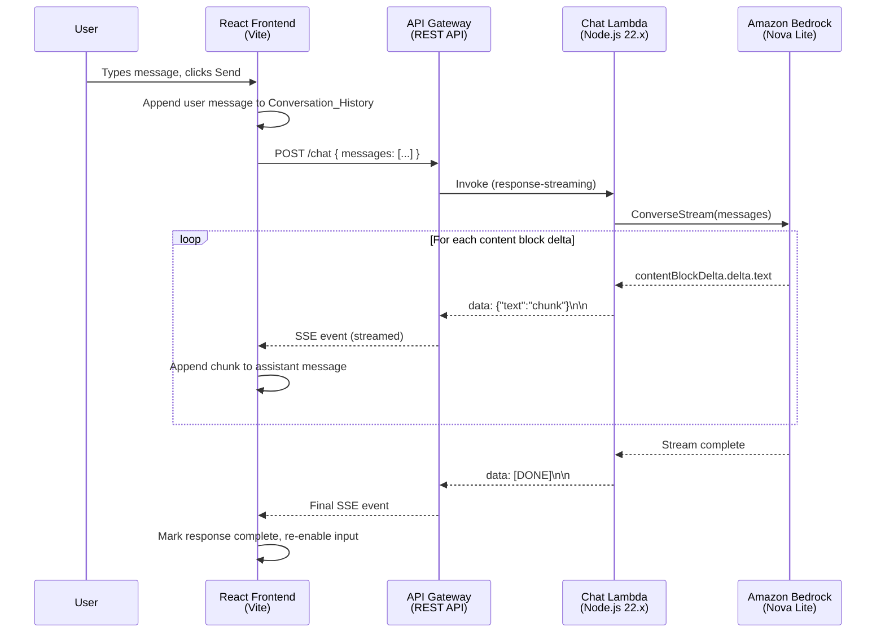
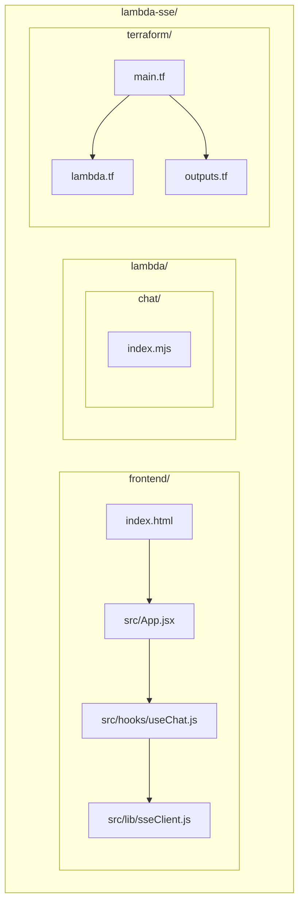

# Design Document: Lambda SSE Chatbot

## Overview

This feature adds an interactive chatbot demo to the repository. A React frontend sends user messages via POST to an API Gateway REST API endpoint (`/chat`). API Gateway routes the request to a streaming Lambda function, which calls Amazon Bedrock ConverseStream (Nova Lite) and writes each text chunk back as an SSE-formatted event (`data: <JSON>\n\n`). The frontend consumes the stream using the Fetch API with `getReader()` (since native `EventSource` only supports GET), rendering tokens progressively in a chat UI.

The demo lives in a new `lambda-sse/` top-level directory, following the existing project convention of one directory per demo. It extends the streaming pattern already established in `lambda-streaming/` by adding SSE framing, CORS support, multi-turn conversation history, and a browser-based frontend.

### Key Design Decisions

1. **SSE over raw streaming** — Wrapping Bedrock chunks in `data: ...\n\n` gives the frontend a well-defined framing protocol to parse, with a clean `[DONE]` sentinel for stream termination.
2. **POST + Fetch API instead of EventSource** — `EventSource` is GET-only and cannot send a JSON body. Using `fetch()` with a readable stream lets us POST conversation history while still consuming SSE.
3. **Conversation history on the client** — The frontend accumulates messages in React state and sends the full array with each request. The Lambda is stateless — no server-side session storage needed.
4. **Inline OpenAPI body for API Gateway** — Consistent with the existing `lambda-streaming/` pattern. Required for `responseTransferMode: STREAM` and allows CORS OPTIONS to be defined declaratively.
5. **No node_modules for Lambda** — The Lambda only uses `@aws-sdk/client-bedrock-runtime`, which is bundled in the Node.js 22.x runtime. No package.json or install step needed.
6. **Vite + React for the frontend** — Lightweight, fast dev server, and produces static output. The API URL is injected via `VITE_API_URL` environment variable.

## Architecture





## Components and Interfaces

### 1. Chat Lambda (`lambda-sse/lambda/chat/index.mjs`)

The streaming Lambda function. Single file, no dependencies beyond the bundled AWS SDK.

**Interface:**

```javascript
// Entry point — uses awslambda.streamifyResponse
export const handler = awslambda.streamifyResponse(async (event, responseStream, context) => {
  // 1. Parse event.body → { messages: [{ role, content }] }
  // 2. Validate messages array exists and is non-empty
  // 3. Set response headers via HttpResponseStream.from():
  //    - Content-Type: text/event-stream
  //    - Access-Control-Allow-Origin: *
  // 4. Call Bedrock ConverseStream with messages
  // 5. For each contentBlockDelta, write: data: {"text":"<chunk>"}\n\n
  // 6. Write: data: [DONE]\n\n
  // 7. Close stream
});
```

**Request body (from API Gateway event):**

```json
{
  "messages": [
    { "role": "user", "content": "Hello" },
    { "role": "assistant", "content": "Hi there!" },
    { "role": "user", "content": "Tell me about Lambda streaming" }
  ]
}
```

**SSE output format:**

```
data: {"text":"Lambda"}\n\n
data: {"text":" streaming"}\n\n
data: {"text":" allows..."}\n\n
data: [DONE]\n\n
```

**Error output (Bedrock failure):**

```
data: {"error":"Failed to invoke model: <message>"}\n\n
data: [DONE]\n\n
```

**Validation error (missing/empty messages):**

Returns via `HttpResponseStream.from()` with `statusCode: 400`:

```json
{ "error": "Request body must contain a non-empty 'messages' array" }
```

### 2. SSE Client (`lambda-sse/frontend/src/lib/sseClient.js`)

A utility module that wraps `fetch()` + `getReader()` to consume SSE from a POST endpoint.

**Interface:**

```javascript
/**
 * Sends a POST request and consumes the SSE response stream.
 * @param {string} url - The API endpoint URL
 * @param {Array} messages - Conversation history
 * @param {function} onChunk - Called with each text chunk as it arrives
 * @param {function} onDone - Called when the [DONE] event is received
 * @param {function} onError - Called on fetch failure or non-200 status
 * @returns {Promise<void>}
 */
export async function streamChat(url, messages, { onChunk, onDone, onError }) { ... }
```

**Parsing logic:**
- Reads the response body via `response.body.getReader()`
- Decodes chunks with `TextDecoder`
- Buffers partial lines, splits on `\n\n` boundaries
- Extracts payload after `data: ` prefix
- Calls `onChunk` for JSON payloads, `onDone` for `[DONE]`

### 3. useChat Hook (`lambda-sse/frontend/src/hooks/useChat.js`)

React hook that manages conversation state and orchestrates streaming.

**Interface:**

```javascript
/**
 * @returns {{
 *   messages: Array<{ role: string, content: string }>,
 *   isStreaming: boolean,
 *   error: string | null,
 *   sendMessage: (text: string) => void,
 *   clearMessages: () => void
 * }}
 */
export function useChat() { ... }
```

**Behavior:**
- Maintains `messages` array in React state (the Conversation_History)
- `sendMessage(text)` appends a user message, adds an empty assistant message, then calls `streamChat()`
- `onChunk` updates the last assistant message's content by appending the chunk
- `onDone` sets `isStreaming = false`
- `onError` sets the error state and `isStreaming = false`
- While `isStreaming` is true, `sendMessage` is a no-op
- `clearMessages()` resets the messages array and error state. No-op while streaming.

### 4. App Component (`lambda-sse/frontend/src/App.jsx`)

Root React component rendering the chat UI.

**Structure:**
- Header: title + "Clear" button (visible when conversation has messages, disabled while streaming)
- Quick prompts: shown when conversation is empty — predefined example messages the user can click to send immediately
- Message list: scrollable container rendering each message with role-based styling (user vs assistant)
- Assistant messages rendered as Markdown via `react-markdown`
- Streaming indicator: shown while `isStreaming` is true
- Input area: text input + send button, disabled while `isStreaming`
- Error display: shown when `error` is non-null

### 5. Terraform Infrastructure (`lambda-sse/terraform/`)

Three files following the existing convention:

**`main.tf`** — Provider config, REST API with OpenAPI body, deployment, stage:
- AWS provider: region `eu-south-2`, profile `demo`
- OpenAPI body defines:
  - `POST /chat` with streaming Lambda integration (`responseTransferMode: STREAM`, URI uses `/response-streaming-invocations`)
  - `OPTIONS /chat` with mock integration returning CORS headers

**`lambda.tf`** — Lambda function, IAM role, permissions, packaging:
- IAM role with `bedrock:InvokeModelWithResponseStream` on `arn:aws:bedrock:eu-south-2::foundation-model/amazon.nova-lite-v1:0`
- `AWSLambdaBasicExecutionRole` managed policy
- `archive_file` data source zipping `../lambda/chat/`
- Lambda function: `nodejs22.x`, 120s timeout, handler `index.handler`
- Lambda permission for API Gateway invocation

**`outputs.tf`** — Chat endpoint URL output

## Data Models

### Message Object

Used throughout the system — in the frontend state, the POST request body, and the Bedrock API call.

```typescript
interface Message {
  role: "user" | "assistant";
  content: string;
}
```

### Chat Request Body

Sent from the frontend to the `/chat` endpoint.

```typescript
interface ChatRequest {
  messages: Message[];  // Non-empty array; full conversation history
}
```

### SSE Event Payloads

Written by the Lambda to the response stream.

```typescript
// Text chunk event
interface SSETextEvent {
  text: string;
}

// Error event
interface SSEErrorEvent {
  error: string;
}

// Terminal event (literal string, not JSON)
// "data: [DONE]\n\n"
```

### Frontend Chat State

Managed by the `useChat` hook.

```typescript
interface ChatState {
  messages: Message[];      // Full conversation history (user + assistant)
  isStreaming: boolean;     // True while receiving SSE events
  error: string | null;     // Last error message, or null
}
```

### Bedrock ConverseStream Input

The Lambda maps the request messages to Bedrock's expected format:

```javascript
// Each message in the request maps directly to Bedrock's format:
{
  modelId: "amazon.nova-lite-v1:0",
  messages: [
    { role: "user", content: [{ text: "Hello" }] },
    { role: "assistant", content: [{ text: "Hi!" }] },
    { role: "user", content: [{ text: "Tell me more" }] }
  ],
  inferenceConfig: { maxTokens: 4096 }
}
```

Note: Bedrock expects `content` as an array of content blocks (`[{ text: "..." }]`), while the frontend sends `content` as a plain string. The Lambda performs this mapping.

## Correctness Properties

*A property is a characteristic or behavior that should hold true across all valid executions of a system — essentially, a formal statement about what the system should do. Properties serve as the bridge between human-readable specifications and machine-verifiable correctness guarantees.*

### Property 1: SSE format/parse round-trip

*For any* non-empty text string, formatting it as an SSE text event (`data: {"text":"<string>"}\n\n`) and then parsing that SSE event back should yield the original text string.

**Validates: Requirements 1.3, 3.2**

### Property 2: Lambda message mapping to Bedrock format

*For any* valid messages array (non-empty, alternating user/assistant roles, each with a non-empty content string), the Lambda should map every message to Bedrock's expected format (`{ role, content: [{ text }] }`) and pass the complete array to ConverseStream with modelId `amazon.nova-lite-v1:0`.

**Validates: Requirements 1.2, 4.3**

### Property 3: Conversation history integrity

*For any* sequence of user messages and completed assistant responses, the conversation history should contain all messages in chronological order, and each subsequent POST request body should include the full conversation history up to and including the new user message.

**Validates: Requirements 2.2, 4.1, 4.2**

### Property 4: Chunk concatenation equals full response

*For any* sequence of SSE text chunks received during a single assistant response, concatenating all chunk texts in order should produce the complete assistant message content stored in the conversation history.

**Validates: Requirements 2.3**

### Property 5: Input gating during streaming

*For any* chat state where `isStreaming` is true, calling `sendMessage` should have no effect — the messages array and streaming state should remain unchanged.

**Validates: Requirements 2.5**

### Property 6: Frontend error handling on fetch failure

*For any* HTTP response with a non-200 status code, or any network error during fetch, the frontend should set an error message in state and set `isStreaming` to false.

**Validates: Requirements 3.3, 6.3**

### Property 7: Lambda error SSE formatting

*For any* error message string thrown by Bedrock, the Lambda should write a valid SSE event containing the error message (`data: {"error":"<message>"}\n\n`) followed by the `[DONE]` sentinel, and then close the stream.

**Validates: Requirements 6.1**

## Error Handling

### Lambda-Side Errors

| Scenario | Behavior |
|---|---|
| Missing or empty `messages` array | Return 400 via `HttpResponseStream.from()` with `{ "error": "Request body must contain a non-empty 'messages' array" }`. Stream is not opened. |
| Invalid JSON in request body | Return 400 with `{ "error": "Invalid JSON in request body" }`. |
| Bedrock invocation failure | Write `data: {"error":"<message>"}\n\n` then `data: [DONE]\n\n` and close the stream. The SSE framing ensures the frontend can parse the error. |
| Bedrock stream interruption mid-response | Catch the error, write an SSE error event with the failure reason, then `[DONE]`, then close. The frontend will have partial content plus the error. |

### Frontend-Side Errors

| Scenario | Behavior |
|---|---|
| Fetch returns non-200 status | Read the response body for an error message, set `error` state, set `isStreaming = false`, re-enable input. |
| Network error (fetch throws) | Catch the exception, set `error` state with a user-friendly message ("Network error — please check your connection"), set `isStreaming = false`. |
| SSE event contains `error` field | Display the error message from the event in the UI. Continue reading the stream until `[DONE]`. |
| Malformed SSE data (unparseable JSON) | Skip the malformed event and continue processing. Log a warning to the console. |

### CORS Errors

If the browser blocks the request due to CORS, the fetch will throw a `TypeError`. This is handled by the generic network error path in the frontend.

## Testing Strategy

### Dual Testing Approach

This feature uses both unit tests and property-based tests for comprehensive coverage:

- **Unit tests**: Verify specific examples, edge cases, integration points, and error conditions
- **Property-based tests**: Verify universal properties across randomly generated inputs

### Property-Based Testing Configuration

- **Library**: [fast-check](https://github.com/dubzzz/fast-check) for JavaScript/TypeScript
- **Minimum iterations**: 100 per property test
- **Tag format**: Each property test must include a comment referencing the design property:
  ```
  // Feature: lambda-sse-chatbot, Property N: <property title>
  ```
- Each correctness property must be implemented by a single property-based test

### Test Breakdown

#### Property-Based Tests

| Property | What to Generate | What to Assert |
|---|---|---|
| P1: SSE format/parse round-trip | Arbitrary non-empty strings (including special chars, newlines, unicode) | `parse(format(text)) === text` |
| P2: Lambda message mapping | Arrays of `{ role, content }` with valid alternating roles | All messages present in Bedrock command, content wrapped in `[{ text }]`, correct modelId |
| P3: Conversation history integrity | Sequences of (user message, assistant response) pairs | History length = 2N after N exchanges; each POST body = full history + new message |
| P4: Chunk concatenation | Arrays of arbitrary non-empty strings (simulating chunks) | Concatenation of chunks = final assistant message content |
| P5: Input gating | Arbitrary messages while `isStreaming = true` | State unchanged after `sendMessage` call |
| P6: Error handling | Random non-200 HTTP status codes (4xx, 5xx) | `error` is set, `isStreaming` is false |
| P7: Lambda error formatting | Arbitrary error message strings | Output matches `data: {"error":"<msg>"}\n\n` + `data: [DONE]\n\n` |

#### Unit Tests

| Area | Tests |
|---|---|
| Lambda validation | Empty body → 400; missing messages key → 400; empty messages array → 400 |
| Lambda SSE output | Correct `Content-Type` header; `[DONE]` sentinel written at end; `Access-Control-Allow-Origin: *` header present |
| Frontend `[DONE]` handling | `isStreaming` becomes false; input re-enabled |
| Frontend env config | `VITE_API_URL` is read and used as the fetch URL |
| SSE parser edge cases | Partial chunks across read boundaries; multiple events in a single chunk; empty data fields |

### Test File Locations

```
lambda-sse/
├── lambda/chat/__tests__/
│   ├── handler.test.mjs          # Unit tests for Lambda handler
│   ├── handler.property.test.mjs # Property tests for Lambda (P2, P7)
│   └── sse-format.property.test.mjs # Property test for SSE formatting (P1)
├── frontend/src/__tests__/
│   ├── useChat.test.js           # Unit tests for useChat hook
│   ├── useChat.property.test.js  # Property tests for chat state (P3, P4, P5)
│   ├── sseClient.test.js         # Unit tests for SSE parser
│   ├── sseClient.property.test.js # Property test for SSE parsing (P1)
│   └── errorHandling.property.test.js # Property test for error handling (P6)
```
